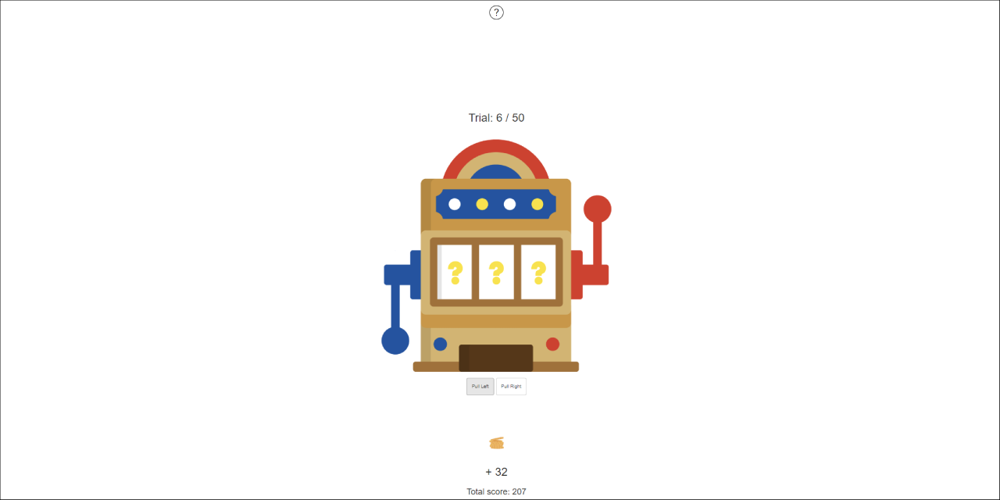

# Two-armed bandit game with reinforcement learning analysis Shiny app

This repository contains a Shiny application that implements a Two-Armed Bandit game, where players interact with a bandit, choosing between two arms that offer different reward potentials. The goal is to maximize the total score by deducing which arm currently offers the higher bonus. The game includes multiple rounds, allowing players to refine their strategies.

After completing all rounds, a reinforcement learning model (Kalman UCB) analyzes the player's choices, and the decision history characteristics are displayed using visualizations. The results include:

- **Arm Selection Distribution**: Frequency of selecting each arm throughout the game.
- **UCB Value for Each Arm**: Upper Confidence Bound (UCB) value estimated by the model for each arm over time.
- **Probability of Choosing Each Arm**: Probability of selecting each arm based on the model's estimates.
- **Reaction Times**: Player's reaction times for each decision throughout the game.
- **Cumulative Reward**: Accumulated rewards over the course of the game.
- **Cumulative Regret**: Difference between the maximum possible reward and the player's actual reward.

Try the live demo of the application here: [Live Demo](https://pmarcowski.shinyapps.io/two-armed-bandit/).

## License

This code is licensed under the MIT license found in the LICENSE file in the root directory of this source tree.

## Features

- **Interactive Gameplay**: Players can choose between two arms of the bandit, aiming to maximize their total score by selecting the arm with the higher bonus.
- **Multiple Rounds**: The game includes multiple rounds, allowing players to refine their strategies and adapt to the changing rewards.
- **Reinforcement Learning Analysis**: After completing all rounds, a Kalman UCB model analyzes the player's choices and provides insights into the decision-making process.
- **Visualizations**: The app displays various visualizations of the player's performance, including arm selection distribution, UCB values, choice probabilities, reaction times, cumulative reward, and cumulative regret.
- **Explanatory Modals**: The app includes explanatory modals that provide information about the game rules and results, accessible through a question mark button.
- **Data Download**: Players can download their game data as a CSV file for further analysis.
- **Customizable Parameters**: The game includes several adjustable parameters to customize the gameplay experience (see the "Parameters" section below).

## Customizable Parameters

The Two-Armed Bandit game offers several customizable parameters that allow you to adjust the game settings and behavior. These parameters include:

- `num_trials`: The total number of trials (rounds) in the game. Default is 90.
- `flip_prob`: The probability of the higher reward arm flipping between the left and right arms. Default is 0.07.
- `payoff_range`: The range of payoff values for each arm. Default is 10 to 40.
- `flip_bonus`: The bonus added to the payoff of the higher reward arm. Default is 20.

You can modify these parameters in the `Global` section of the script to customize the game according to your preferences. Adjusting these parameters will impact the game difficulty, duration, and the underlying dynamics of the bandit's reward structure.

## Model Details

The Two-Armed Bandit game utilizes the Kalman UCB model, a reinforcement learning algorithm that balances exploration and exploitation. The model estimates the expected reward and uncertainty for each arm based on the player's choices and the observed rewards. It explains the player's decision-making process by considering both the estimated reward and the uncertainty associated with each arm. The Kalman UCB model is implemented in the `kalman_ucb` function in the script. The model parameters are estimated using the `get_fit` function.

## Installation

1. Ensure R is installed with the necessary packages.
2. Clone this repository or download the necessary files.
3. Open the R script containing the Shiny app code.
4. Run the script or execute the `shiny::runApp()` command in the R console.

## Feedback and Questions

If you have any feedback, suggestions, or questions regarding this application, please feel free to open an issue on the GitHub repository or contact the author directly.
